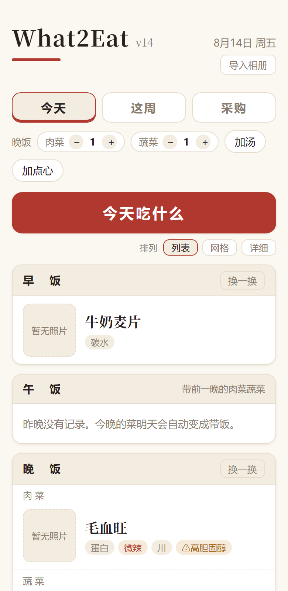
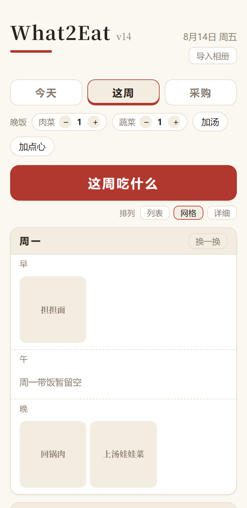
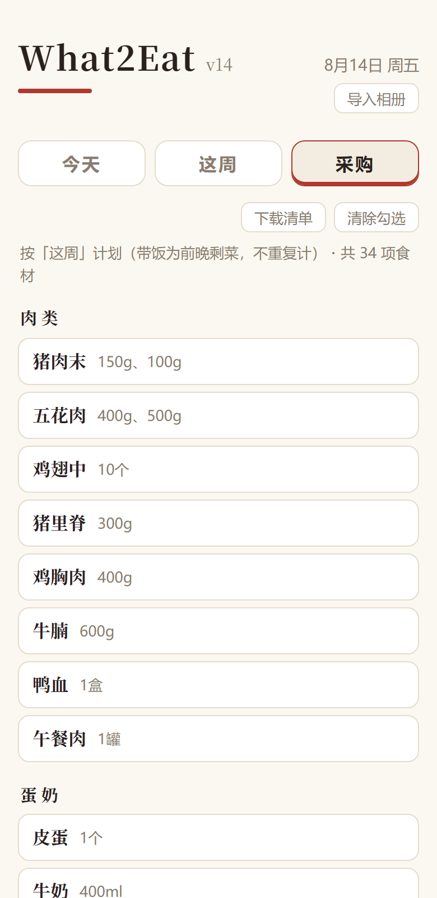
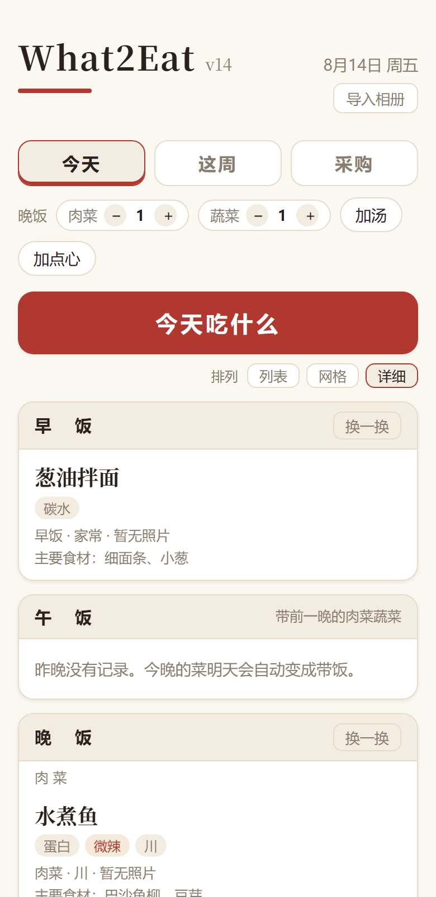

# What2Eat 家里的菜

把家庭相册里的做菜照片变成带图菜单：一键生成今天/整周吃什么，午饭自动带前一晚的菜，并按菜单聚合出带报价的采购清单。产出是一个单文件 HTML，放哪都能用。

| 今天吃什么 | 这周（网格） | 采购清单 | 详细排列 |
|---|---|---|---|
|  |  |  |  |

## 快速开始（5 分钟，无需相册）

```bash
git clone https://github.com/weihaoc168/What2Eat && cd What2Eat
pip install pillow
python scripts/build_from_preset.py 经典家常   # 或 川湘风味 / 粤式清淡
```

打开 `dist/jiali-de-cai.html` 即可。预设菜单无照片，可在应用内「导入相册 → 手机照片」逐道补图。

## 接入自己的相册（AI 自动认菜）

需要：Synology Photos 共享相册的公开分享链接 + [Anthropic API Key](https://platform.claude.com)（识图约 $0.01–0.03/张）。

```bash
pip install anthropic pillow
cp .env.example .env    # 填 SYNO_HOST / SHARE_PASSPHRASE / ANTHROPIC_API_KEY

python scripts/import_album.py                # 首次运行：建基线，不花钱
python scripts/import_album.py --backfill 50  # 可选：识别最近 50 张建初始菜单库
```

之后家人往相册拍新菜，跑一句 `python scripts/import_album.py` 就自动认菜、打标签、生成食材清单、重建应用（`--dry-run` 可先预览）。挂到 cron / NAS 任务计划里每天跑一次即全自动。

无图的菜可以补齐：`python scripts/match_photos.py` 让 AI 从合照里匹配裁切真实照片，`python scripts/generate_images.py` 给剩下的生成统一风格插画（均需 API Key；应用内点开菜的大图可随时换成自家实拍）。

生成的 HTML 内嵌家庭照片，放内网（如 NAS Web Station），别放公网。

## 微信小程序

```bash
python scripts/build_miniprogram.py
```

用[微信开发者工具](https://developers.weixin.qq.com/miniprogram/dev/devtools/download.html)导入 `miniprogram/` 目录（AppID 选免费测试号），点「预览」扫码即可真机使用。正式发布需自己的个人 AppID。

## 发布状态与内测

| 平台 | 状态 |
|---|---|
| 网页版 | 可用（本仓库自行构建） |
| 安卓版（Google Play） | 封闭测试招募中，正式上架前需 12 名测试员参与 14 天 |
| 微信小程序 | 提审准备中 |

**参加安卓内测**：发邮件到 weihaoc168@gmail.com（附你的 Google 账号邮箱），或在本仓库开 Issue 留下邮箱，收到邀请链接后安装即可，全程无需其他操作。名额有限，先到先得。

## License

MIT。仓库只含代码与预设菜单，`.env`、照片、个人数据均已 gitignore。
